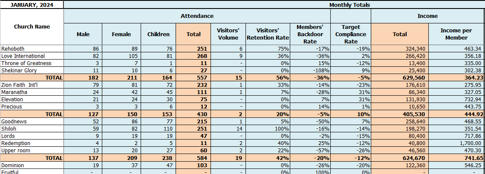
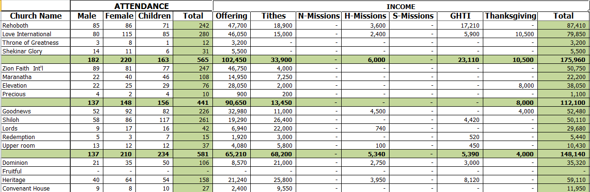

# Excel Operations Dashboard

This project is an Excel-based reporting system designed to track, analyze, and summarize operational data across multiple centres.

It demonstrates my ability to work with structured data, build reporting systems, and support business decision-making.

💼 Available for remote contract work | $25/hr

---

## 📊 Features
- Multi-centre data tracking  
- Monthly and quarterly reporting  
- Summary dashboard with key metrics  
- Structured and easy-to-update format  

---

## 🧠 Use Case
This type of system can be used for:
- Business operations reporting  
- Financial tracking  
- Performance monitoring across multiple units  

---

## 🛠 Tools Used
- Microsoft Excel  
- Formulas (SUMIF, COUNTIF, etc.)  
- Tables and charts  

---

## 📸 Screenshots

### Dashboard Overview

### Data Table

### Summary Report

---

## 📂 File
Download the Excel file to explore full functionality:
📥 assests/dashboard.xlsx

---

## 👤 Author
Chimkamma Caleb Agbim  
Remote Web & Operations Support Contractor  
